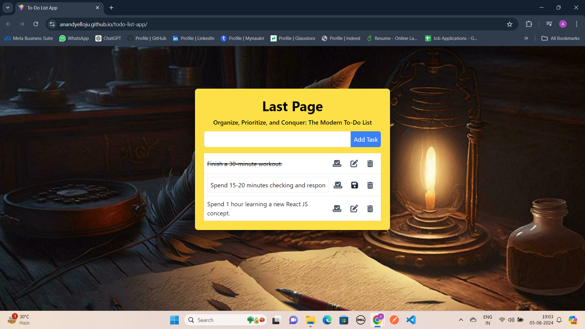

# LastPage - To-Do List App

A simple and efficient To-Do List application built using React and Tailwind CSS. This app helps you manage your tasks efficiently by allowing you to add, edit, delete, and mark tasks as completed.

**Live Demo -** https://anandyelloju.github.io/todo-list-app/

## Table of Contents

- [Screenshots](#screenshots)
- [Installation](#installation)
- [Usage](#usage)
- [Features](#features)
- [Technologies Used](#technologies-used)
- [Contributing](#contributing)
- [Credits](#credits)
- [License](#license)

## Screenshots



## Installation

1. Clone the repository:
    ```bash
    git clone https://github.com/anandyelloju/todo-list-app.git
    ```
2. Navigate to the project directory:
    ```bash
    cd todo-list-app
    ```
3. Install the dependencies:
    ```bash
    npm install
    ```
4. Start the development server:
    ```bash
    npm run dev
    ```

## Usage

1. Open the app in your browser. By default, it should be running at `http://localhost:5173`.
2. Add new tasks using the input field and 'Add' button.
3. Mark tasks as completed by clicking on them.
4. Edit or delete tasks using the respective buttons next to each task.
<!--
## Features

- Add new tasks
- Edit existing tasks
- Delete tasks
- Mark tasks as completed
- Responsive design

## Technologies Used

- React
- Tailwind CSS
- Vite
- JavaScript
- HTML
- CSS

[](https://skillicons.dev)

## Contributing

Contributions are always welcome! - If you have suggestions or improvements.

## Credits

- [Anand Yelloju](https://github.com/anandyelloju) - Project Creator

## License

This project is licensed under the [MIT License](https://choosealicense.com/licenses/mit/) - see the [LICENSE](https://github.com/anandyelloju/my-portfolio/blob/main/LICENSE) file for details.
-->
